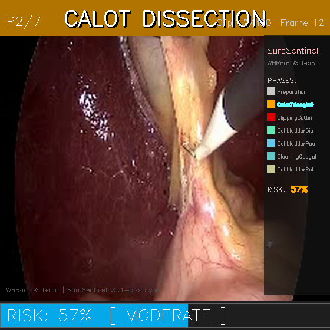

# SurgSentinel - Surgical Safety AI

> Real-Time Intraoperative Phase Recognition + Complication Risk Prediction  
> Open-Source | Device-Agnostic | Low-Resource Deployable  
> **Harivignesh** | AI x HealthTech Research | 2025–2026

[](https://opensource.org/licenses/MIT)
[](https://www.python.org/downloads/)
[](https://pytorch.org/)

---

## The Problem

**3.5 billion people** lack access to safe, affordable surgery. In laparoscopic cholecystectomy (gallbladder removal) — the most common abdominal procedure worldwide — **bile duct injuries (BDI)** remain the most feared complication. **85% of BDIs occur during the Critical View of Safety (CVS) phase** and are largely preventable with better situational awareness.

SurgSentinel is an AI system that provides **real-time surgical phase recognition and complication risk prediction**, giving surgeons a second pair of eyes during the most dangerous moments of a procedure.

## What This System Does



**Real-time overlay on laparoscopic video with three key elements:**

- **Phase Banner** (top) — Full-width color-coded bar showing the current surgical phase (7 phases, color-coded from safe gray/green to warning orange to critical red)
- **Risk Score Bar** (bottom) — Animated bar that transitions green → amber → red as the procedure enters high-risk phases (Calot Triangle Dissection, Clipping & Cutting)
- **Phase Legend Sidebar** (right) — Always-visible phase list with active phase highlighted, plus system info

## Quick Start

```bash
git clone https://github.com/YOUR_USERNAME/surgical-safety-ai.git
cd surgical-safety-ai
pip install -r requirements.txt
python setup/download_data.py
python inference/demo.py --speed 3
```

### Controls
| Key | Action |
|-----|--------|
| `SPACE` | Pause / Resume |
| `+` / `-` | Speed up / Slow down |
| `S` | Save screenshot |
| `R` | Reset to beginning |
| `Q` / `ESC` | Quit |

## Architecture

```
┌─────────────────────────────────────────────────────────┐
│                    SurgSentinel Model                    │
│                                                         │
│  ┌─────────────────┐    ┌──────────────────────────┐   │
│  │  Module 1a       │    │  Module 1b                │   │
│  │  EfficientNet-B3 │───>│  Instrument Detection     │   │
│  │  Spatial Encoder │    │  (7 tools, binary)        │   │
│  │  [1536-d features│    └──────────────────────────┘   │
│  └────────┬────────┘                                    │
│           │ [B*T, 512]                                  │
│  ┌────────▼────────┐    ┌──────────────────────────┐   │
│  │  Module 2        │    │  Phase Classification     │   │
│  │  Transformer     │───>│  Head (7 phases)          │   │
│  │  Temporal Encoder│    └──────────────────────────┘   │
│  │  (2-layer)       │                                   │
│  └────────┬────────┘                                    │
│           │ [B, T, 768]                                 │
│  ┌────────▼────────┐    ┌──────────────────────────┐   │
│  │  Module 3        │    │  Risk Score               │   │
│  │  BiLSTM          │───>│  (sigmoid, 0-1)           │   │
│  │  Risk Head       │    │  Novel contribution       │   │
│  └─────────────────┘    └──────────────────────────┘   │
└─────────────────────────────────────────────────────────┘
```

**Key design decisions:**
- **EfficientNet-B3** over ResNet-50: 3x faster at equivalent accuracy (12M params)
- **BiLSTM risk head**: Novel jointly-trained complication risk predictor with 10-second lookback
- **Focal loss** for risk training: Handles 8% positive class imbalance without oversampling (which would corrupt temporal continuity)

## Technical Stack

| Component | Choice | Rationale |
|-----------|--------|-----------|
| Spatial Encoder | EfficientNet-B3 (ImageNet) | Best accuracy/speed tradeoff for real-time |
| Temporal Model | Transformer Encoder (2-layer) | Captures phase transitions across frames |
| Risk Prediction | BiLSTM (2-layer, bidirectional) | Temporal context for risk scoring |
| Instrument Detection | Binary classification head | 7 Cholec80 standard instruments |
| Dataset | Cholec80 (MSTCN clips) | Gold standard for surgical phase recognition |
| Inference | OpenCV real-time overlay | Language-free, works on any display |
| Target Hardware | RTX 3050 (4GB VRAM) | Low-resource deployment viable |

## Project Structure

```
surgical-safety-ai/
├── CLAUDE.md                     # Build plan and architecture notes
├── README.md                     # This file
├── requirements.txt
├── .gitignore
├── setup/
│   ├── check_cuda.py             # GPU verification
│   ├── download_data.py          # Kaggle API downloader
│   └── verify_demo.py            # Headless rendering test
├── models/
│   └── system.py                 # Full 4-module model architecture
├── train/
│   └── loss.py                   # Multi-task focal loss (reference)
├── utils/
│   ├── clip_reader.py            # MSTCN clip playlist + phase parser
│   └── risk_proxy.py             # Rule-based risk score (prototype)
├── inference/
│   └── demo.py                   # Main demo runner
├── assets/
│   ├── phase_colors.py           # Phase definitions and color mapping
│   └── demo_screenshot.png       # Demo screenshot
└── data/                         # Created by downloader (gitignored)
    └── cholec80/
        └── test_data_mstcn/      # MSTCN video clips
```

## Prototype vs Full System

This is an honest prototype. The architecture is complete and real. The inference uses annotation-assisted mode (ground truth phase labels from filenames drive the overlay) alongside the full model definition.

| Feature | Prototype (this repo) | Full System (planned) |
|---------|----------------------|----------------------|
| Model architecture | Complete (4 modules) | Same |
| Spatial encoder | ImageNet-pretrained | Fine-tuned on Cholec80 |
| Phase recognition | Ground truth from filenames | Trained transformer |
| Risk prediction | Rule-based proxy | Trained BiLSTM |
| Instrument detection | Architecture defined | YOLOv8 fine-tuned |
| Dataset | MSTCN clips (subset) | Full Cholec80 (80 videos) |
| ONNX export | Architecture ready | Quantized + optimized |
| Clinical validation | Phase risk literature | CVS annotation protocol |

## Scientific Contributions

1. **C1**: First jointly trained phase recognition + complication risk prediction architecture for laparoscopic surgery
2. **C2**: Reproducible CVS-based high-risk window annotation protocol
3. **C3**: Hardware efficiency benchmark for low-resource surgical AI deployment

## Cholec80 Phases

| Phase | Name | Risk Level |
|-------|------|------------|
| P1 | Preparation | Low |
| P2 | Calot Triangle Dissection | **HIGH** (BDI danger zone) |
| P3 | Clipping & Cutting | **CRITICAL** |
| P4 | Gallbladder Dissection | Low |
| P5 | Gallbladder Packaging | Minimal |
| P6 | Cleaning & Coagulation | Minimal |
| P7 | Gallbladder Retraction | Minimal |

## License

MIT License — see [LICENSE](LICENSE) for details.

---

*Harivignesh — AI x HealthTech Research Division*  
*SurgSentinel Prototype v0.1 | Public Welfare AI | 2025–2026*
